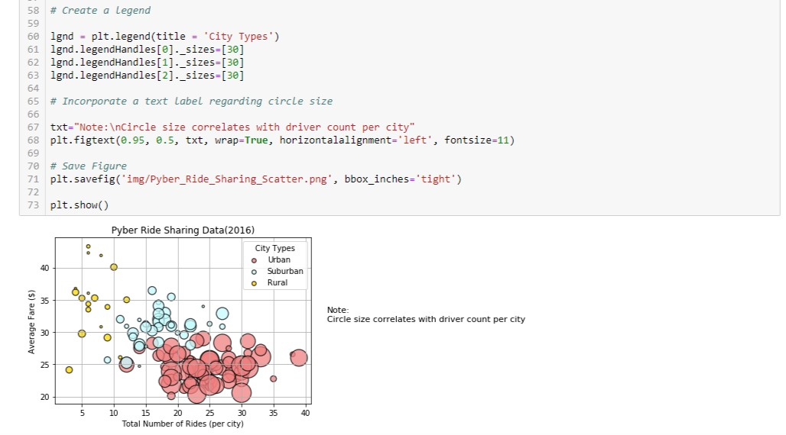
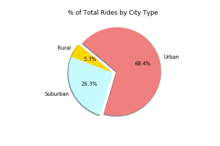

# Pyber Analysis
## The Power of Plots

Using two CSV files that provide City Data and Ride Data, create:
* Bubble Plot of Ride Sharing Data

* Pie Chart of Total Fares by City Type
* Pie Chart of Total Rides by City Type

* Pie Chart of Total Drivers by City Type
